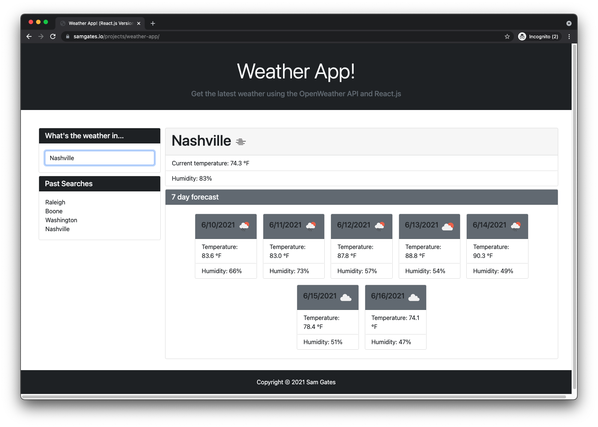

# Weather App! (React.js Version)

## Description

For this project, I re-wrote the Weather App! using React.js. This app utilizes the OpenWeather API to get current weather conditions for any city that you search along with a 7 day forecast. The app also stores your past searches for future reference. Currently not a responsive/mobile design, that is in development.

## Deployed

See the deployed version on my portfolio site [here](https://samgates.io/projects/weather-app/).

## Install and Test

Download the repo, get your API key, configure the app to use your API key and try it out.

## License

Copyright (c) Sam Gates. All rights reserved.
Licensed under the [MIT](https://opensource.org/licenses/MIT) license.

## Questions

Check out my [GitHub Profile](https://github.com/sg0703).

Email with questions! You can reach me at sam.j.gates@gmail.com.
